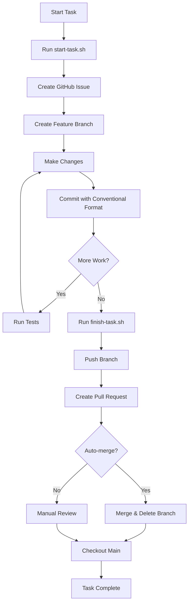

# GitHub Development Workflow

This workflow implements a declarative development process where each task creates a GitHub issue, work happens in feature branches with incremental commits, and integration occurs via pull requests.

## Workflow Overview

```
1. Create Issue → 2. Create Branch → 3. Incremental Development → 4. Testing → 5. Pull Request → 6. Merge
```

## Quick Start

### Starting a New Task

// turbo-all
```bash
# Run the automated task starter
.agent/scripts/start-task.sh
```

This will:
1. Prompt you for task type (feature/bug/chore)
2. Create a GitHub issue
3. Create and checkout a feature branch named: `{type}/{issue-number}-{task-name}`

### During Development

1. **Make incremental changes** - Break work into logical chunks
2. **Commit frequently** using conventional commits:
   ```bash
   git commit -m "feat: add navigation component"
   git commit -m "test: add navigation tests"
   git commit -m "docs: update README with navigation info"
   ```

3. **Run tests after each significant chunk**:
   ```bash
   npm test
   npm run lint
   npm run build
   ```

4. **Push to remote periodically** (optional):
   ```bash
   git push -u origin <branch-name>
   ```

### Finishing the Task

// turbo
```bash
# Run the automated task finisher
.agent/scripts/finish-task.sh
```

This will:
1. Check for uncommitted changes
2. Push branch to remote
3. Create a pull request
4. Optionally merge the PR
5. Switch back to main branch

## Conventional Commit Format

Use the following prefixes for commits:

- `feat:` - New feature
- `fix:` - Bug fix
- `docs:` - Documentation changes
- `style:` - Code style changes (formatting, etc.)
- `refactor:` - Code refactoring
- `test:` - Adding or updating tests
- `chore:` - Maintenance tasks
- `perf:` - Performance improvements
- `ci:` - CI/CD changes
- `build:` - Build system changes

**Examples:**
```bash
git commit -m "feat: implement user authentication"
git commit -m "fix: resolve navigation menu overlap issue"
git commit -m "test: add unit tests for auth service"
```

## Branch Naming Convention

Branches are automatically named using the pattern:
```
{type}/{issue-number}-{kebab-case-title}
```

**Examples:**
- `feat/42-add-guestbook-page`
- `fix/43-navbar-mobile-responsive`
- `chore/44-update-dependencies`

## Testing Checkpoints

After each significant chunk of work, run:

### 1. Linting
```bash
npm run lint
```

### 2. Type Checking
```bash
npm run type-check  # or tsc --noEmit if type-check script doesn't exist
```

### 3. Build Verification
```bash
npm run build
```

### 4. Unit Tests (if applicable)
```bash
npm test
```

### 5. Manual Testing
- Start dev server: `npm run dev`
- Test changed functionality in browser
- Verify responsive design
- Check console for errors

## Pull Request Guidelines

### Auto-generated PR Description Format

```markdown
## Summary
Brief description of what this PR accomplishes

## Changes
- List of key changes
- Organized by commit

## Testing
- [ ] Linting passes
- [ ] Build succeeds
- [ ] Manual testing completed
- [ ] No console errors

Closes #[issue-number]
```

### Before Creating PR

- [ ] All tests pass
- [ ] Code is linted
- [ ] Build succeeds
- [ ] Commits follow conventional format
- [ ] Branch is up to date with main

## Manual Workflow (Alternative)

If you prefer manual control:

### 1. Create Issue
```bash
gh issue create --title "Task title" --body "Description" --label "enhancement"
```

### 2. Create Branch
```bash
# Note the issue number from step 1
git checkout -b feat/123-task-name
```

### 3. Development
```bash
# Make changes
git add .
git commit -m "feat: description"

# Run tests
npm test
npm run lint
```

### 4. Create PR
```bash
git push -u origin feat/123-task-name
gh pr create --title "PR Title" --body "Description\n\nCloses #123"
```

### 5. Merge
```bash
gh pr merge --squash --delete-branch
git checkout main
git pull
```

## Agent Integration

When I (Antigravity) start a new task, I will:

1. **Automatically run** `.agent/scripts/start-task.sh` with appropriate inputs
2. **Create incremental commits** as work progresses
3. **Run verification** after each major chunk:
   - Linting
   - Build
   - Tests
4. **Create detailed PR** when task is complete
5. **Auto-merge** if tests pass (with your approval)

## Configuration Files

- **Issue Templates**: `.github/ISSUE_TEMPLATE/`
  - `feature.yml` - For new features
  - `bug.yml` - For bug reports
  - `task.yml` - For general tasks
  
- **Automation Scripts**: `.agent/scripts/`
  - `start-task.sh` - Initialize workflow
  - `finish-task.sh` - Complete workflow

## Tips & Best Practices

1. **Keep commits atomic** - Each commit should represent a single logical change
2. **Write descriptive commit messages** - Future you will thank you
3. **Test incrementally** - Don't wait until the end to test
4. **Push frequently** - Backup your work in progress
5. **Keep PRs focused** - One issue per PR
6. **Review your own PR** - Check the diff before requesting review
7. **Delete merged branches** - Keep the repository clean

## Troubleshooting

### Issue: Branch name too long
- Shorten the task title when creating the issue
- Manually rename branch: `git branch -m new-name`

### Issue: Forgot to create issue first
- Create issue manually: `gh issue create`
- Rename branch to include issue number

### Issue: Need to update main branch
```bash
git checkout main
git pull
git checkout <feature-branch>
git rebase main
```

### Issue: Want to create PR without merging
- Run `finish-task.sh` and choose "No" when asked to merge
- Or manually: `gh pr create`

## Workflow Diagram


