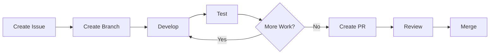

# Development Workflow

This project uses a declarative GitHub-based development workflow to maintain code quality and provide clear audit trails of changes.

## Quick Start

### Starting a New Task

Run the automated task starter:

```bash
.agent/scripts/start-task.sh
```

This will:
1. Prompt for task type (feature/bug/task)
2. Create a GitHub issue
3. Create and checkout a feature branch

### During Development

Make changes incrementally and commit using conventional commit format:

```bash
git add .
git commit -m "feat: add new component"

# Run tests after significant chunks
npm run lint
npm run build
npm test
```

### Finishing a Task

Run the automated task finisher:

```bash
.agent/scripts/finish-task.sh
```

This will:
1. Push your branch
2. Create a pull request
3. Optionally merge and clean up

## Commit Message Convention

We use [Conventional Commits](https://www.conventionalcommits.org/):

- `feat:` - New features
- `fix:` - Bug fixes
- `docs:` - Documentation changes
- `test:` - Adding or updating tests
- `chore:` - Maintenance tasks
- `refactor:` - Code refactoring
- `style:` - Code style changes
- `perf:` - Performance improvements

**Examples:**
```bash
git commit -m "feat(navbar): add mobile menu animation"
git commit -m "fix(auth): resolve token expiration issue"
git commit -m "docs: update API documentation"
```

## Branch Naming

Branches are automatically named following this pattern:

```
{type}/{issue-number}-{kebab-case-description}
```

**Examples:**
- `feat/42-add-guestbook-page`
- `fix/43-mobile-navigation-bug`
- `chore/44-dependency-updates`

## Workflow Steps



## Testing Checkpoints

Before creating a PR, ensure:

```bash
# Linting passes
npm run lint

# Build succeeds  
npm run build

# Tests pass
npm test

# Manual testing
npm run dev
```

## Full Documentation

For complete workflow documentation, see:
- [GitHub Workflow Guide](.agent/workflows/github-workflow.md)
- [Issue Templates](.github/ISSUE_TEMPLATE/)

## Manual Workflow (Alternative)

If you prefer manual control, you can still use GitHub CLI directly:

```bash
# Create issue
gh issue create --title "Task title" --label "enhancement"

# Create branch
git checkout -b feat/123-task-name

# Create PR
gh pr create --title "PR title" --body "Description"
```
